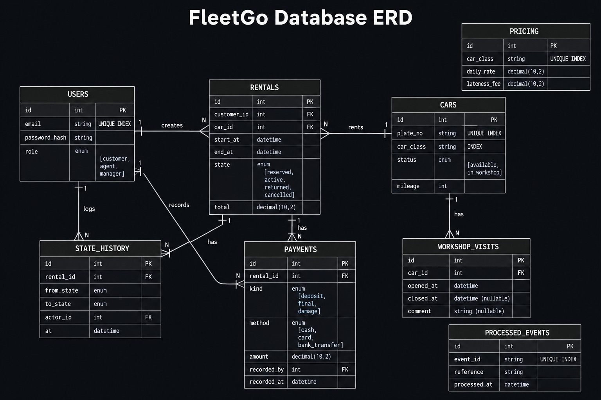
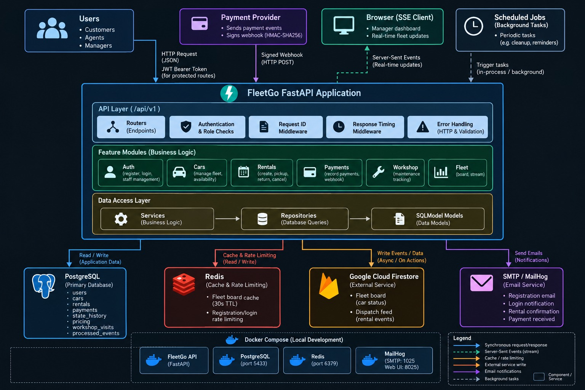

# FleetGo

FleetGo is a FastAPI backend for car rental and fleet management. It handles customer registration and authentication, vehicle availability, rental reservations, rental state transitions, payments, workshop status, fleet reporting, signed payment webhooks, Redis caching and rate limiting, Server-Sent Events, Firestore integration, and SMTP notifications.

## Overview


FleetGo models the rental lifecycle around a small, explicit state machine:

```text
RESERVED ──────► ACTIVE ──────► RETURNED
    │
    └───────────► CANCELLED
```

A rental is created directly in the `RESERVED` state. Pickup moves it to `ACTIVE`, return moves it to `RETURNED`, and a reservation can be cancelled before pickup.

Rental state changes are protected by a PostgreSQL row lock and recorded in `state_history`. This prevents two concurrent pickup requests from both successfully moving the same rental to `ACTIVE`.

Car physical status is handled separately:

```text
AVAILABLE ◄──────► IN_WORKSHOP
```

Availability for a requested date range is determined from the car's workshop status and overlapping `RESERVED` or `ACTIVE` rentals rather than from a single car status field.

PostgreSQL is the primary data store. Redis is used for fleet-board caching and authentication rate limiting. Firestore provides a secondary fleet-board and dispatch-event feed when configured. SMTP is used for customer notifications and MailHog is provided for local email testing.

---

## Features

- Customer registration
- JWT-based authentication
- Bcrypt password hashing
- Three user roles:
  - `customer`
  - `agent`
  - `manager`
- Role-based route protection
- Manager-only staff account creation
- Manager bootstrap seed script
- Car creation
- Car availability search by class and date range
- Rental creation and reservation
- Rental state machine
- PostgreSQL row locking for concurrent pickup protection
- Append-only rental state history records
- Server-side rental pricing
- Late-fee calculation at return
- Damage-charge handling at return
- Agent-recorded rental payments
- Payment methods:
  - cash
  - card
  - bank transfer
- Payment kinds:
  - deposit
  - final
  - damage
- Workshop status management
- Workshop visit records
- Redis fleet-board caching
- Redis-backed login and registration rate limiting
- Signed payment webhooks
- HMAC-SHA256 webhook verification
- Duplicate webhook protection using `processed_events`
- Orphan payment-event handling
- Server-Sent Events fleet stream
- In-process SSE broadcaster with a 15-second heartbeat
- Firestore fleet-board and dispatch-feed integration
- Graceful Firestore stubbing when credentials are unavailable
- SMTP customer notifications
- Graceful SMTP stubbing when SMTP is not configured
- Centralized HTTP and validation error responses
- Request ID middleware
- Response timing middleware
- API versioning under `/api/v1`

---

## Tech Stack

### Backend


### Database & Caching


### Payments & Integrations


### Database Migrations & Testing


### DevOps & Tooling


> The project contains a GitHub Actions-style CI definition in `test.yaml`, but it is not currently located under `.github/workflows/`, so GitHub Actions is not presented as an active CI badge.

---

## Architecture


FleetGo is organized by feature rather than putting every router, service, and repository into global layer folders.

Each feature generally follows this structure:

```text
router.py
    ↓
service.py
    ↓
repository.py
    ↓
PostgreSQL
```

Schemas sit alongside the feature and define request and response models.

```text
                     ┌──────────────────────┐
                     │      FastAPI API     │
                     │       /api/v1        │
                     └──────────┬───────────┘
                                │
              ┌─────────────────┼─────────────────┐
              │                 │                 │
              ▼                 ▼                 ▼
        Auth / Cars         Rentals /        Payments /
        Workshop            State Machine     Webhooks
              │                 │                 │
              └────────────┬────┴─────────────────┘
                           ▼
                    ┌───────────────┐
                    │   SQLModel    │
                    │   / SQLAlchemy│
                    └───────┬───────┘
                            ▼
                    ┌───────────────┐
                    │  PostgreSQL   │
                    └───────────────┘

        ┌──────────────────────────────────────────┐
        │                Supporting Services       │
        ├──────────────────────────────────────────┤
        │ Redis                                    │
        │  ├── Fleet-board cache                   │
        │  └── Login/register rate limiting        │
        │                                          │
        │ Firestore                                │
        │  ├── fleet_board                         │
        │  └── dispatch_feed                       │
        │                                          │
        │ SMTP / MailHog                           │
        │  └── Customer notifications              │
        │                                          │
        │ SSE Broadcaster                           │
        │  └── /fleet/stream                       │
        └──────────────────────────────────────────┘
```

### Feature Architecture

The main feature folders are:

```text
app/features/
├── auth/
├── cars/
├── fleet/
├── payments/
├── rentals/
└── workshop/
```

The feature modules contain:

```text
schemas.py      request/response models
repository.py   database queries
service.py      business logic
router.py       HTTP routes
```

The rental feature also contains:

```text
state_machine.py
pricing.py
```

The state machine is the single place responsible for changing rental state.

### Transaction Boundary

Business operations update PostgreSQL first and commit before triggering external side effects such as:

- Redis invalidation
- Firestore writes
- SSE events

This prevents external consumers from being notified about changes that later roll back.

---

## Project Structure

```text
FleetGo_car_project/
├── .dockerignore
├── .env
├── .env.example
├── .gitignore
├── Dockerfile
├── LOG.md
├── README.md
├── alembic.ini
├── docker-compose.yml
├── mock_payment_provider.py
├── package.json
├── pyproject.toml
├── test.yaml
├── uv.lock
│
├── alembic/
│   ├── README
│   ├── env.py
│   ├── script.py.mako
│   └── versions/
│       ├── 3f4abfadee7d_initial_migration.py
│       ├── eddf6d24e70f_add_cars_pricing_rentals_state_history_.py
│       ├── f2a9c1d8e6b7_add_damage_payment_kind.py
│       └── c4d7e2f1a9b3_add_payment_method.py
│
├── app/
│   ├── __init__.py
│   ├── main.py
│   │
│   ├── core/
│   │   ├── __init__.py
│   │   ├── config.py
│   │   ├── dependencies.py
│   │   ├── error.py
│   │   ├── rate_limit.py
│   │   ├── redis_client.py
│   │   └── security.py
│   │
│   ├── db/
│   │   ├── __init__.py
│   │   ├── base.py
│   │   ├── seed.py
│   │   └── session.py
│   │
│   ├── events/
│   │   ├── __init__.py
│   │   └── broadcaster.py
│   │
│   ├── integrations/
│   │   ├── __init__.py
│   │   ├── email.py
│   │   ├── events.py
│   │   ├── firestore.py
│   │   └── notifications.py
│   │
│   ├── middleware/
│   │   ├── __init__.py
│   │   ├── request_id.py
│   │   └── timing.py
│   │
│   ├── models/
│   │   ├── __init__.py
│   │   ├── car.py
│   │   ├── payment.py
│   │   ├── pricing.py
│   │   ├── processed_event.py
│   │   ├── rental.py
│   │   ├── state_history.py
│   │   ├── user.py
│   │   └── workshop_visit.py
│   │
│   └── features/
│       ├── auth/
│       │   ├── __init__.py
│       │   ├── repository.py
│       │   ├── router.py
│       │   ├── schemas.py
│       │   └── service.py
│       │
│       ├── cars/
│       │   ├── __init__.py
│       │   ├── repository.py
│       │   ├── router.py
│       │   ├── schemas.py
│       │   └── service.py
│       │
│       ├── fleet/
│       │   ├── __init__.py
│       │   ├── repository.py
│       │   ├── router.py
│       │   ├── schemas.py
│       │   └── service.py
│       │
│       ├── payments/
│       │   ├── __init__.py
│       │   ├── repository.py
│       │   ├── router.py
│       │   ├── schemas.py
│       │   ├── service.py
│       │   ├── webhook_router.py
│       │   ├── webhook_schemas.py
│       │   └── webhook_service.py
│       │
│       ├── rentals/
│       │   ├── __init__.py
│       │   ├── pricing.py
│       │   ├── repository.py
│       │   ├── router.py
│       │   ├── schemas.py
│       │   ├── service.py
│       │   └── state_machine.py
│       │
│       └── workshop/
│           ├── __init__.py
│           ├── repository.py
│           ├── router.py
│           ├── schemas.py
│           └── service.py
│
└── tests/
    ├── conftest.py
    ├── test_fleetgo.py
    ├── auth/
    │   └── test_auth.py
    ├── cars/
    │   └── test_cars.py
    ├── payments/
    │   └── test_payments.py
    ├── rentals/
    │   ├── test_pickup.py
    │   ├── test_rental_concurrency.py
    │   ├── test_rentals.py
    │   ├── test_return.py
    │   └── test_state_machine.py
    ├── webhooks/
    │   └── test_payment_webhook.py
    └── workshop/
        └── test_workshop.py
```

---

## Installation

### Requirements

- Python 3.13 or newer
- Docker
- Docker Compose
- uv

The normal development setup uses Docker for PostgreSQL, Redis, MailHog, and the API.

### 1. Configure environment variables

Copy the example environment file:

```bash
cp .env.example .env
```

Fill in the required values described below.

The current configuration also requires `FIRESTORE_CREDENTIALS_PATH`, even though that variable is not currently listed in `.env.example`.

### 2. Start the Docker services

```bash
docker compose up -d --build
```

This starts:

- FleetGo API
- PostgreSQL
- Redis
- MailHog

### 3. Apply database migrations

The API container does not automatically run Alembic migrations during startup.

Run:

```bash
docker compose exec api uv run alembic upgrade head
```

### 4. Check the API

Interactive FastAPI documentation:

```text
http://localhost:8000/docs
```

Database connectivity endpoint:

```text
GET http://localhost:8000/test-db
```

### 5. Seed the first manager

```bash
docker compose exec api uv run python -m app.db.seed
```

The script checks whether its bootstrap account already exists before inserting it.

The credentials hardcoded in the seed script are intentionally not reproduced in this README.

---

## Environment Variables

Settings are loaded by `app/core/config.py` using Pydantic Settings and `.env`.

| Variable | Required | Default / Notes |
|---|---|---|
| `DATABASE_URL` | Yes | PostgreSQL connection string |
| `TEST_DATABASE_URL` | No | Separate PostgreSQL database used by tests |
| `REDIS_URL` | Yes | Redis connection string |
| `JWT_SECRET` | Yes | Secret used to sign JWTs |
| `JWT_ALGORITHM` | No | Defaults to `HS256` |
| `ACCESS_TOKEN_EXPIRE_MINUTES` | No | Defaults to `30` |
| `BCRYPT_ROUNDS` | No | Defaults to `12` |
| `WEBHOOK_SECRET` | Yes | Secret used for payment webhook HMAC verification |
| `SMTP_HOST` | No | SMTP server hostname |
| `SMTP_PORT` | No | Defaults to `587` |
| `SMTP_USERNAME` | No | SMTP username |
| `SMTP_PASSWORD` | No | SMTP password |
| `SMTP_FROM_EMAIL` | No | Sender email |
| `FIRESTORE_CREDENTIALS_PATH` | Yes | Path to the Firestore service-account JSON file |
| `API_PREFIX` | No | Defaults to `/api/v1` |

Do not commit real values for:

```text
JWT_SECRET
WEBHOOK_SECRET
SMTP_PASSWORD
FIRESTORE_CREDENTIALS_PATH
```

The supplied `.gitignore` excludes `.env` and the Firebase credential JSON pattern used by the project.

### Docker-specific configuration

Inside Docker Compose, the API uses:

```text
postgres:5432
redis:6379
mailhog:1025
```

From the host machine:

```text
PostgreSQL → localhost:5433
Redis      → localhost:6379
MailHog    → localhost:1025
MailHog UI → localhost:8025
```

---

## Database

FleetGo uses PostgreSQL as its primary database.

SQLModel provides the model layer and SQLAlchemy provides the underlying database engine and transaction functionality.

### Database Tables

| Table | Purpose |
|---|---|
| `users` | Application users and roles |
| `cars` | Fleet vehicles |
| `rentals` | Customer rental reservations and lifecycle state |
| `pricing` | Pricing by car class |
| `payments` | Payments recorded against rentals |
| `state_history` | Accepted rental state transitions |
| `workshop_visits` | Car workshop visits |
| `processed_events` | Payment webhook idempotency records |

### Users

Users have one of three roles:

```text
customer
agent
manager
```

Emails are unique.

Passwords are stored as bcrypt hashes rather than plaintext passwords.

### Cars

Cars contain:

- plate number
- car class
- physical status
- mileage

Car classes currently represented by the model are:

```text
ECONOMY
SUV
LUXURY
TRUCK
```

Car status is:

```text
AVAILABLE
IN_WORKSHOP
```

### Rentals

A rental contains:

- customer
- car
- start time
- end time
- state
- total

The rental table has a composite index on:

```text
(car_id, start_at, end_at)
```

This supports the date-overlap availability query.

### Payments

Payment records contain:

- rental
- payment kind
- payment method
- amount
- recording user
- timestamp

Payment kinds:

```text
deposit
final
damage
```

Payment methods:

```text
cash
card
bank_transfer
```

### Processed Events

`processed_events.event_id` is unique.

The payment webhook inserts the event before processing the associated reference. A duplicate event therefore hits the database uniqueness constraint and is treated as already processed.

---

## Migrations

Alembic manages database migrations.

The current migration chain is:

```text
3f4abfadee7d
    ↓
eddf6d24e70f
    ↓
f2a9c1d8e6b7
    ↓
c4d7e2f1a9b3
```

The migrations cover:

1. Initial `users` table
2. Cars, pricing, rentals, state history, payments, workshop visits, and processed events
3. `damage` payment kind
4. Payment methods

### Apply migrations

```bash
docker compose exec api uv run alembic upgrade head
```

### Create a migration

```bash
docker compose exec api uv run alembic revision --autogenerate -m "description"
```

### Check migration state

```bash
docker compose exec api uv run alembic current
```

---

## API

All feature routers are mounted under:

```text
/api/v1
```

The prefix is configured through `API_PREFIX`.

Interactive API documentation:

```text
http://localhost:8000/docs
```

### Authentication

#### Register

```http
POST /api/v1/auth/register
```

Public endpoint.

Registration always creates a `customer`.

Example:

```json
{
  "email": "customer@example.com",
  "password": "a-strong-password"
}
```

#### Login

```http
POST /api/v1/auth/login
```

Public endpoint.

Example:

```json
{
  "email": "customer@example.com",
  "password": "a-strong-password"
}
```

Response contains a bearer access token.

#### Create Staff

```http
POST /api/v1/staff
```

Manager only.

The endpoint can create:

```text
agent
manager
```

---

## Cars

### Create a Car

```http
POST /api/v1/cars
```

Manager only.

Example:

```json
{
  "plate_no": "ABC-123-XY",
  "car_class": "SUV"
}
```

### Search Available Cars

```http
GET /api/v1/cars
```

The search accepts:

```text
car_class
start
end
```

A car is excluded when:

- it is currently in the workshop
- it has a `RESERVED` rental overlapping the requested period
- it has an `ACTIVE` rental overlapping the requested period

The overlap condition is:

```text
existing.start_at < requested.end
AND
existing.end_at > requested.start
```

### Update Pricing

```http
PUT /api/v1/pricing/{car_class}
```

Manager only.

Example:

```json
{
  "daily_rate": "15000.00",
  "lateness_fee": "2500.00"
}
```

---

## Rentals

### Create a Rental

```http
POST /api/v1/rentals
```

Authenticated customer.

Example:

```json
{
  "car_id": 1,
  "start_at": "2026-10-03T10:00:00",
  "end_at": "2026-10-05T10:00:00"
}
```

The rental is created directly as:

```text
RESERVED
```

The total is calculated server-side from the pricing record for the car's class.

### Get a Rental

```http
GET /api/v1/rentals/{rental_id}
```

Customers can access their own rentals. Staff users can access rentals according to the route's authentication behavior.

### Pick Up a Rental

```http
POST /api/v1/rentals/{rental_id}/pickup
```

Agent only.

Optional request body:

```json
{
  "mileage": 45210
}
```

Valid transition:

```text
RESERVED → ACTIVE
```

### Return a Rental

```http
POST /api/v1/rentals/{rental_id}/return
```

Agent only.

Example:

```json
{
  "damage_charge": "5000.00",
  "payment_method": "card"
}
```

Valid transition:

```text
ACTIVE → RETURNED
```

At return:

- late fees are calculated server-side
- damage charges are added to the rental total
- a damage payment is recorded when the damage charge is greater than zero

### Cancel a Rental

```http
POST /api/v1/rentals/{rental_id}/cancel
```

Valid transition:

```text
RESERVED → CANCELLED
```

Other state transitions are rejected with a conflict response.

---

## Rental State Machine

The allowed transitions are explicitly defined in:

```text
app/features/rentals/state_machine.py
```

```text
RESERVED → ACTIVE
ACTIVE   → RETURNED
RESERVED → CANCELLED
```

The implementation does not allow arbitrary state changes.

Before changing a rental, the state machine performs a locking database read using:

```text
SELECT ... FOR UPDATE
```

This protects concurrent pickup operations.

Every successful transition creates a corresponding `state_history` row.

---

## Pricing

Initial rental pricing is calculated using:

```text
daily_rate × whole rental days
```

The implementation guarantees at least one billed day for a same-day rental.

Late fees are calculated separately when a rental is returned.

If:

```text
actual_return_at <= end_at
```

the late fee is zero.

When the return is late, any partial late day is counted as a full day.

---

## Payments

There are two payment paths.

### Agent-recorded Payments

```http
POST /api/v1/rentals/{rental_id}/payments
```

Example:

```json
{
  "kind": "deposit",
  "method": "card",
  "amount": "25000.00"
}
```

Payments cannot be recorded against rentals that are already:

```text
RETURNED
CANCELLED
```

### Payment Webhook

External payment systems can call:

```http
POST /api/v1/webhooks/payment
```

This endpoint does not use JWT authentication.

The request must contain:

```http
X-Signature: <signature>
```

The signature is calculated using HMAC-SHA256 over the raw request body.

The raw body is read before Pydantic validation so the exact bytes received by the API are used for verification.

Example payload:

```json
{
  "event_id": "evt_example",
  "type": "payment.succeeded",
  "reference": "1",
  "amount": 45000,
  "currency": "NGN",
  "paid_at": "2026-10-01T10:00:00Z"
}
```

The webhook service uses `reference` as the rental ID.

Webhook behavior:

| Situation | Response behavior |
|---|---|
| Valid event with existing rental | `confirmed` |
| Same event delivered again | `already processed` |
| Unknown rental reference | `orphan` |
| Invalid signature | `401` |

The webhook records the processed event in `processed_events`. It does not create a `Payment` row from the webhook payload.

---

## Mock Payment Provider

The project includes:

```text
mock_payment_provider.py
```

It uses only the Python standard library and can send signed webhook requests to the API.

Example:

```bash
python mock_payment_provider.py \
  --url http://127.0.0.1:8000/api/v1/webhooks/payment \
  --secret <WEBHOOK_SECRET> \
  --reference <RENTAL_ID> \
  --amount 45000
```

Additional options:

```text
--duplicate
--bad-signature
--orphan
```

These exercise duplicate delivery, invalid signatures, and unknown references.

---

## Workshop

Workshop status is managed separately from rental state.

### Send a Car to the Workshop

```http
POST /api/v1/cars/{car_id}/workshop
```

Manager only.

The car moves:

```text
AVAILABLE → IN_WORKSHOP
```

An optional body can contain:

```json
{
  "comment": "Brake inspection"
}
```

### Return a Car to Service

```http
POST /api/v1/cars/{car_id}/back-in-service
```

Manager only.

The car moves:

```text
IN_WORKSHOP → AVAILABLE
```

Workshop visits are stored in `workshop_visits` with:

- `opened_at`
- `closed_at`
- `comment`

---

## Fleet Board

### Fleet Board

```http
GET /api/v1/fleet/board
```

Manager only.

The board is cached in Redis using:

```text
fleet:board
```

with a TTL of:

```text
30 seconds
```

The cache is invalidated after state-changing operations that affect the fleet board.

### Fleet Stream

```http
GET /api/v1/fleet/stream
```

Manager only.

The endpoint returns:

```text
text/event-stream
```

Events are distributed through an in-process broadcaster.

The broadcaster uses subscriber queues and sends a heartbeat comment every 15 seconds:

```text
: heartbeat
```

The stream does not continuously poll PostgreSQL.

---

## Rate Limiting

Redis is also used for rate limiting.

The public authentication endpoints:

```text
POST /api/v1/auth/login
POST /api/v1/auth/register
```

are limited to:

```text
5 attempts per IP
60-second window
```

When the limit is exceeded, the API returns:

```text
HTTP 429 Too Many Requests
```

and includes a `Retry-After` header.

The rate limiter uses Redis `INCR`, `EXPIRE`, and `TTL`.

---

## Authentication

FleetGo uses bearer JWTs.

The authentication flow is:

```text
Register/Login
      │
      ▼
Password verification
      │
      ▼
JWT issued
      │
      ▼
Authorization: Bearer <token>
      │
      ▼
get_current_user
      │
      ▼
User loaded from PostgreSQL
      │
      ▼
require_role(...)
```

JWTs contain:

```text
sub
role
exp
```

Passwords are hashed using bcrypt.

The JWT signing algorithm defaults to:

```text
HS256
```

The default access-token expiration is:

```text
30 minutes
```

---

## Authorization

Role protection is implemented through the reusable `require_role()` dependency.

Manager-protected operations include:

- creating cars
- changing pricing
- workshop operations
- fleet board access
- fleet stream access
- creating staff accounts

Agent-protected operations include:

- rental pickup
- rental return
- recording rental payments

Public operations include:

- registration
- login
- availability search

Customers create rentals using their authenticated identity.

---

## External Services

### Redis

Redis is used for:

```text
Fleet board caching
Authentication rate limiting
```

### Firestore

Firestore is used as a secondary store for:

```text
fleet_board
dispatch_feed
```

PostgreSQL remains the primary source of truth for the application's main relational data.

Firestore writes are performed through `save_document()`.

When Firestore credentials are unavailable, the integration returns a structured `stubbed` result instead of crashing the application.

### SMTP

Customer notifications are sent through SMTP.

Notifications currently include:

```text
Welcome
Login alert
Rental confirmation
Payment received
```

When SMTP is not configured, the email adapter returns a structured stub result instead of sending an email.

### MailHog

Docker Compose includes MailHog for local SMTP testing.

```text
SMTP:   localhost:1025
Web UI: http://localhost:8025
```

---

## Error Handling

FleetGo registers centralized handlers for:

- HTTP exceptions
- request validation errors

Responses include a consistent error envelope:

```json
{
  "detail": "message",
  "error": {
    "code": "http_error",
    "message": "message",
    "request_id": "..."
  }
}
```

Validation failures use:

```text
validation_error
```

HTTP exceptions use:

```text
http_error
```

The request ID comes from the request middleware.

---

## Middleware

Two application middleware components are registered:

```text
RequestIDMiddleware
TimingMiddleware
```

The request ID middleware provides a request identifier that is also included in centralized error responses.

The timing middleware records request/response timing information.

---

## Docker

The project contains a `Dockerfile` and `docker-compose.yml`.

### Services

```text
api
postgres
redis
mailhog
```

### API

The API is built from the project Dockerfile and runs on:

```text
8000
```

The container uses `uv` for dependency management and application execution.

### PostgreSQL

Docker Compose uses:

```text
PostgreSQL 17
```

Container port:

```text
5432
```

Published host port:

```text
5433
```

Named volume:

```text
postgres_data
```

### Redis

Docker Compose uses:

```text
Redis 7
```

Port:

```text
6379
```

### MailHog

MailHog uses:

```text
1025
```

for SMTP and:

```text
8025
```

for its web interface.

### Rebuild the API

After code changes:

```bash
docker compose up -d --force-recreate api
```

---

## Testing

The project uses Pytest.

Tests use a separate database configured through:

```text
TEST_DATABASE_URL
```

The test fixture explicitly prevents the test database from being the same database as `DATABASE_URL`.

The test setup creates the test database if necessary and creates the SQLModel tables before running the tests.

Individual test transactions are rolled back after each test.

Firestore is disabled during tests by clearing the configured credential path.

### Test command

```bash
docker compose exec api uv run pytest -v
```

Coverage includes:

- authentication
- customer registration
- login notifications
- car creation
- duplicate plate protection
- availability search
- pricing
- payment recording
- terminal-rental payment restrictions
- rental creation
- rental pickup
- rental return
- late fees
- damage payments
- rental state transitions
- state-history records
- concurrent pickup behavior
- payment webhook signatures
- webhook idempotency
- orphan webhook events
- workshop transitions
- Firestore adapter behavior
- email adapter behavior
- SSE event publishing

The supplied project files do not provide a current test-run output that independently verifies a current passing test count, so this README does not claim a current passing test count.

---

## Code Quality

Ruff is configured in `pyproject.toml`.

Configured lint rules include:

```text
E
F
I
UP
B
SIM
```

The configured target is:

```text
py313
```

Run:

```bash
docker compose exec api uv run ruff check .
```

The project configuration also specifies an 88-character line length.

---

## CI/CD

The repository contains:

```text
test.yaml
```

with a GitHub Actions-style CI definition.

The configuration defines:

- PostgreSQL 17 service
- Redis 7 service
- `uv` setup
- dependency synchronization
- Ruff linting
- Pytest execution

The CI commands are:

```bash
uv sync --frozen
uvx ruff check .
uv run pytest -v
```

The file is currently located at the project root rather than:

```text
.github/workflows/
```

and is also listed in `.gitignore`.

Therefore, the supplied project does not currently contain an active GitHub Actions workflow in the standard GitHub Actions directory.

---

## Usage

A typical application flow is:

### 1. Start the application

```bash
docker compose up -d --build
```

### 2. Apply migrations

```bash
docker compose exec api uv run alembic upgrade head
```

### 3. Seed the initial manager

```bash
docker compose exec api uv run python -m app.db.seed
```

### 4. Register a customer

```http
POST /api/v1/auth/register
```

```json
{
  "email": "customer@example.com",
  "password": "a-strong-password"
}
```

### 5. Log in

```http
POST /api/v1/auth/login
```

Use the returned access token:

```http
Authorization: Bearer <access_token>
```

### 6. Manager creates a car

```http
POST /api/v1/cars
```

```json
{
  "plate_no": "ABC-123-XY",
  "car_class": "SUV"
}
```

### 7. Manager sets pricing

```http
PUT /api/v1/pricing/SUV
```

```json
{
  "daily_rate": "15000.00",
  "lateness_fee": "2500.00"
}
```

### 8. Customer searches availability

```http
GET /api/v1/cars?start=2026-10-03T10:00:00&end=2026-10-05T10:00:00
```

### 9. Customer creates a rental

```http
POST /api/v1/rentals
```

```json
{
  "car_id": 1,
  "start_at": "2026-10-03T10:00:00",
  "end_at": "2026-10-05T10:00:00"
}
```

### 10. Agent picks up the car

```http
POST /api/v1/rentals/1/pickup
```

Optional:

```json
{
  "mileage": 45210
}
```

### 11. Agent returns the car

```http
POST /api/v1/rentals/1/return
```

```json
{
  "damage_charge": "5000.00",
  "payment_method": "card"
}
```

### 12. Manager monitors the fleet

```http
GET /api/v1/fleet/board
```

or:

```http
GET /api/v1/fleet/stream
```

---

## Important Design Decisions

### Rental state and car status are separate

Rental lifecycle and physical vehicle status represent different concepts.

Rental state:

```text
RESERVED
ACTIVE
RETURNED
CANCELLED
```

Car status:

```text
AVAILABLE
IN_WORKSHOP
```

A workshop visit is therefore not treated as a rental state transition.

### `Rental.car_id` owns the relationship

A car can have many rentals over its lifetime, while each rental belongs to one car.

The foreign key therefore lives on:

```text
rentals.car_id
```

### The state machine owns rental transitions

Rental state changes are centralized in:

```text
app/features/rentals/state_machine.py
```

The allowed moves are stored explicitly in `ALLOWED_MOVES`.

This keeps state-transition rules out of individual route handlers.

### PostgreSQL row locking protects pickup concurrency

The rental repository provides:

```text
get_for_update()
```

which performs a locking read.

This is used by the state machine before applying a transition.

The approach prevents a concurrent pickup race from producing two successful `ACTIVE` transitions.

### State history records accepted transitions

Every successful state transition creates a `StateHistory` record containing:

- rental
- previous state
- new state
- actor
- timestamp

Rejected transitions do not create state-history rows.

### Webhook idempotency uses the database constraint

Webhook processing inserts the `event_id` into `processed_events` and catches the resulting `IntegrityError` when the same event is received again.

This avoids the race condition that can occur with:

```text
SELECT → if missing → INSERT
```

### Webhook signatures use the raw request body

The API verifies the signature before Pydantic parses the payload.

This ensures the signature is calculated against the exact request bytes received by the API.

### Authentication uses bcrypt and JWT

Passwords use bcrypt.

JWTs are used for authenticated API requests.

The mechanisms serve different purposes:

```text
bcrypt      → password hashing
HMAC-SHA256 → webhook message authentication
JWT         → API authentication
```

### External side effects happen after database commits

Redis invalidation, Firestore writes, and SSE publication happen after successful database commits.

This prevents external systems from receiving an event for a database operation that subsequently rolls back.

### API versioning has a single configuration source

The API prefix is defined in settings:

```text
/api/v1
```

and applied when routers are included in `main.py`.

---

## Known Limitations

### GitHub Actions workflow location

The repository contains `test.yaml`, but it is not located in `.github/workflows/` and is ignored by `.gitignore`.

Therefore, it is not currently an active GitHub Actions workflow in the standard GitHub configuration.

### No deployment configuration

The project contains Docker and Docker Compose configuration for the application stack, but no hosted deployment configuration or production deployment URL is present in the supplied files.

### Webhook does not create a Payment record

The signed payment webhook validates and records the event in `processed_events` and returns confirmation/orphan status.

It does not create a row in the `payments` table from the webhook payload.

Agent-recorded payments use:

```text
POST /api/v1/rentals/{rental_id}/payments
```

### Firestore configuration is required by Settings

`FIRESTORE_CREDENTIALS_PATH` is required by the `Settings` model, while `.env.example` does not currently document it.

The Firestore integration itself is designed to stub writes when the configured file does not exist.

### Mileage and return condition behavior

Mileage can be supplied during pickup and is written to the car.

The return schema accepts damage charges and payment method, but does not contain a mileage or vehicle-condition field.

Some older test calls contain fields such as `mileage` and `condition` in return payloads, but the current `RentalReturn` schema does not define those fields.

### In-process SSE broadcaster

The SSE broadcaster stores subscribers in process memory.

The supplied project does not contain a distributed event broker for coordinating SSE subscribers across multiple API processes.

### Firestore credentials

A Firebase service-account JSON credential file is present in the supplied project archive.

Credential files should not be committed to source control or shared publicly.

---

## Future Improvements

The supplied source contains historical development notes describing deployment, CI, demo-data seeding, and other possible follow-up work, but there is no current implementation or authoritative active roadmap for these items.

No additional roadmap is documented here beyond improvements directly supported by the current project state.

---

## Project Status

The current source contains the main FleetGo backend functionality across:

- authentication and authorization
- cars and availability
- pricing
- rentals
- rental state transitions
- state-history auditing
- payments
- payment webhooks
- workshop management
- Redis caching
- rate limiting
- SSE fleet events
- Firestore integration
- SMTP notifications
- Docker-based local infrastructure
- Alembic migrations
- automated tests

The project also contains configuration and test files for linting and CI, but the GitHub Actions-style workflow is not currently located under `.github/workflows/`.

The source and historical `LOG.md` contain some conflicting status information. In particular, `LOG.md` records a scheduled stale-reservation cancellation job as having been merged, but no scheduler or scheduled-job implementation is present in the supplied source tree. This README therefore does not describe such a job as an implemented feature.

---

## License

No license file or explicit project license is present in the supplied project.